# lets-chat — Modern Secure Team Collaboration

> A production-ready, real-time team chat platform rebuilt from the archived [`lets-chat`](https://github.com/sdelements/lets-chat) project. It combines workspaces, public/private channels, direct messages, authenticated file attachments, global search, multi-device session management, and EN/UK/RU localization in a clean, demo-friendly package.

---

## 🚀 Live Demo

- **Web:** https://lets-chat-web.vercel.app
- **API:** https://lets-chat-api-v2.onrender.com/api/v1
- **WebSocket:** wss://lets-chat-api-v2.onrender.com
- **Health:** https://lets-chat-api-v2.onrender.com/api/v1/health

> Demo access is available on request — the public deployment is open for registration with a throwaway email.

Portfolio guidance:

- [`docs/portfolio-demo.md`](docs/portfolio-demo.md) — step-by-step demo flow and screenshot checklist.
- [`docs/demo-script.md`](docs/demo-script.md) — 2–3 minute recruiter narrative.
- [`docs/interview-notes.md`](docs/interview-notes.md) — resume bullets and interview talking points.
- [`docs/job-application-kit.md`](docs/job-application-kit.md) — copy-paste content for resumes, cover letters, and recruiter emails.
- [`docs/final-project-review.md`](docs/final-project-review.md) — final audit, architecture review, and release notes.
- [`docs/project-story.md`](docs/project-story.md) — 30-second and 2-minute project story.
- [`docs/interview-answers.md`](docs/interview-answers.md) — common interview answers in English and Ukrainian.

### For Recruiters

- **Live demo:** https://lets-chat-web.vercel.app
- **Screenshots:** see below or [`docs/portfolio-media/screenshots/`](docs/portfolio-media/screenshots/).
- **Project story:** [`docs/project-story.md`](docs/project-story.md)
- **Resume bullets:** [`docs/resume-project-blocks.md`](docs/resume-project-blocks.md)
- **Interview notes:** [`docs/interview-notes.md`](docs/interview-notes.md)

---

## Tech Stack

| Layer | Technology |
|---|---|
| **Frontend** | Next.js 16 (App Router), React 19, TypeScript 5, Tailwind CSS 4 |
| **Backend** | NestJS 11, TypeScript, Prisma ORM, PostgreSQL 15 |
| **Real-Time** | Socket.io 4, optional Redis adapter (`WEBSOCKET_REDIS_URL`), in-memory presence |
| **Storage** | S3-compatible object storage (uploads and downloads through authenticated API proxy) |
| **Testing** | Jest (API), Vitest + Testing Library (Web), Supertest (E2E) |
| **CI/CD** | GitHub Actions → Render Deploy Hook; Vercel auto-deploy |

---

## ✨ Main Features

### Collaboration

- **Workspaces** — multi-tenant teams with OWNER / ADMIN / MEMBER roles.
- **Channels** — public and private; private channels return `404` to non-members.
- **Direct Messages** — 1-to-1 conversations with participant-only access.
- **Contacts** — private one-way contact list for quick user discovery and starting DMs.
- **Group Invite Links** — owner-generated, expiring token links that let people join groups without knowing their user IDs.
- **Group Chats** — standalone multi-member conversations outside workspaces, with owner/member roles, invite links, unread counts, and real-time delivery.
- **User Blocking & Reporting** — block users to stop new DMs, contact adds, and targeted group adds; report users or messages.
- **Admin Moderation Dashboard** — `/admin/reports` page for `ADMIN`/`MODERATOR` users to review reports, update status, and add internal notes.
- **Admin Audit Log** — `/admin/audit` page with searchable, paginated security event trail covering auth, moderation, channels, groups, and attachments.
- **Recruiter demo mode** — one-click "Try live demo" creates a disposable verified user, an isolated demo workspace with seeded channels/messages, and skips email providers. Disabled by default; gated by `DEMO_MODE_ENABLED`.
- **Real-time messaging** — live create/update/delete/reaction events via WebSocket rooms.
- **Replies & Forwarding** — thread replies and message forwarding between channels.
- **Reactions** — emoji reactions with toggle/replace behavior.
- **Read receipts** — per-message seen status.
- **Push notifications** — Web Push with VAPID for new direct messages, channel messages, and group messages; opt-in from Profile → Notifications.
- **PWA installability** — add to home screen, standalone app shell, offline fallback page; install section in Profile → App install.
- **Global search** — search across workspaces, channels, and DMs with jump-to-message.

### Auth & Security

- **JWT auth** — access/refresh token rotation, bcrypt hashing, per-tab `sessionStorage`.
- **Session management** — list active sessions, revoke others, current-session protection.
- **Silent token refresh** — `authFetch` intercepts 401s, refreshes once, and retries without logout.
- **Private-channel security** — non-members receive `404` at REST, WebSocket, and search layers.
- **Owner-only destructive actions** — workspace/channel delete and archive restricted to OWNER.
- **User blocking** — bidirectional block enforcement at DMs, contacts, group member adds, and push notifications; generic error responses hide block state.
- **Admin moderation** — role-based `ADMIN`/`MODERATOR` access; report review endpoints return only safe summaries and reject regular users with `403`.
- **Audit log trail** — security events are persisted with severity, actor, target, and redacted metadata; sensitive keys (tokens, secrets, DB/Redis URLs) are sanitized before storage.

### Attachments

- Drag-and-drop or file-picker upload with progress and retry.
- Authenticated downloads — no direct public URLs.
- Inline image previews and lightbox.
- File type validation and practical category limits.
- Cyrillic filename support.

### Localization

- English, Ukrainian, Russian UI.
- Cyrillic usernames and workspace names with auto-transliteration to URL slugs.

---

## 🛡️ Security & Reliability Highlights

- Private channels leak no existence, title, or membership data to outsiders.
- Message edit is restricted to the author within a 15-minute window.
- Message delete is restricted to author, admins, and owners.
- Direct messages are accessible only to the two participants.
- WebSocket events revalidate channel/DM membership on the server.
- Auth endpoints return generic success messages to avoid account enumeration.
- Production database migration runs before API deploy.
- Automated smoke and attachment verification scripts run after every deploy.

---

## 🧪 Testing & CI

| Suite | Count | Status |
|---|---|---|
| API unit tests | 930 (48 suites) | ✅ passing |
| Web unit tests | 739 (38 files) | ✅ passing |
| Web pages tests | 268 (2 files) | ✅ passing |
| E2E security smoke tests | 81 (8 suites) | ✅ passing in CI (PostgreSQL service) |

- **CI:** GitHub Actions runs lint, typecheck, unit tests, builds, and API E2E security smoke tests (with a PostgreSQL service container) on every push.
- **Deploy:** Render deploy hook fires only after green CI; Vercel builds the frontend in parallel.
- **Verification:** `scripts/smoke-deploy.mjs`, `scripts/verify-production-attachments.mjs`, `scripts/verify-production-groups.mjs`, `scripts/verify-production-contacts.mjs`, `scripts/verify-production-safety.mjs`, `scripts/verify-production-admin-reports.mjs`, `scripts/verify-production-audit.mjs`, and `scripts/verify-production-demo.mjs` (skipped when demo mode is disabled) run against production after deploy.

---

## 📸 Screenshots

All screenshots were captured from the live production deployment after the B206 visual polish pass.

### Desktop

| Screen | Preview |
|---|---|
| Login | 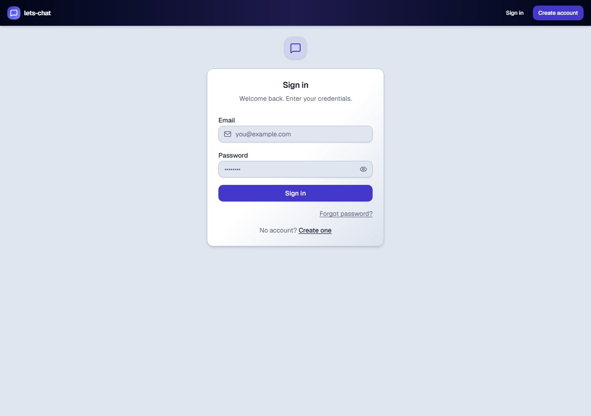 |
| Dashboard | 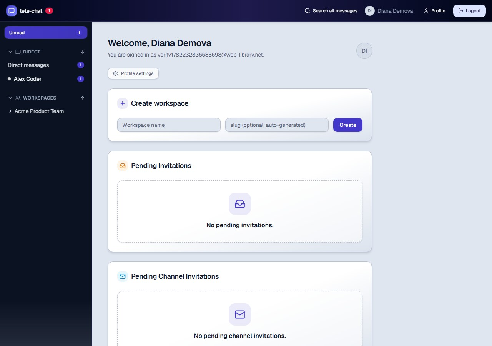 |
| Workspace overview | 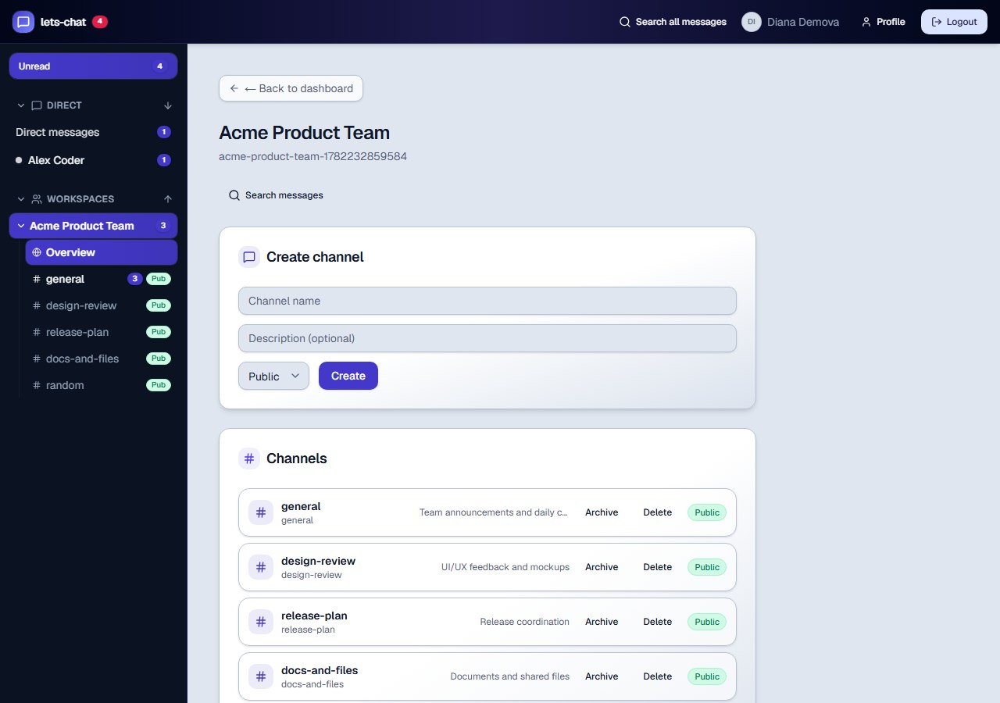 |
| Channel messages | 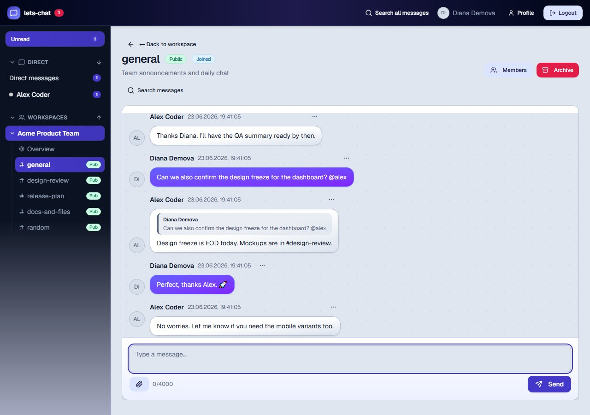 |
| Channel attachments | 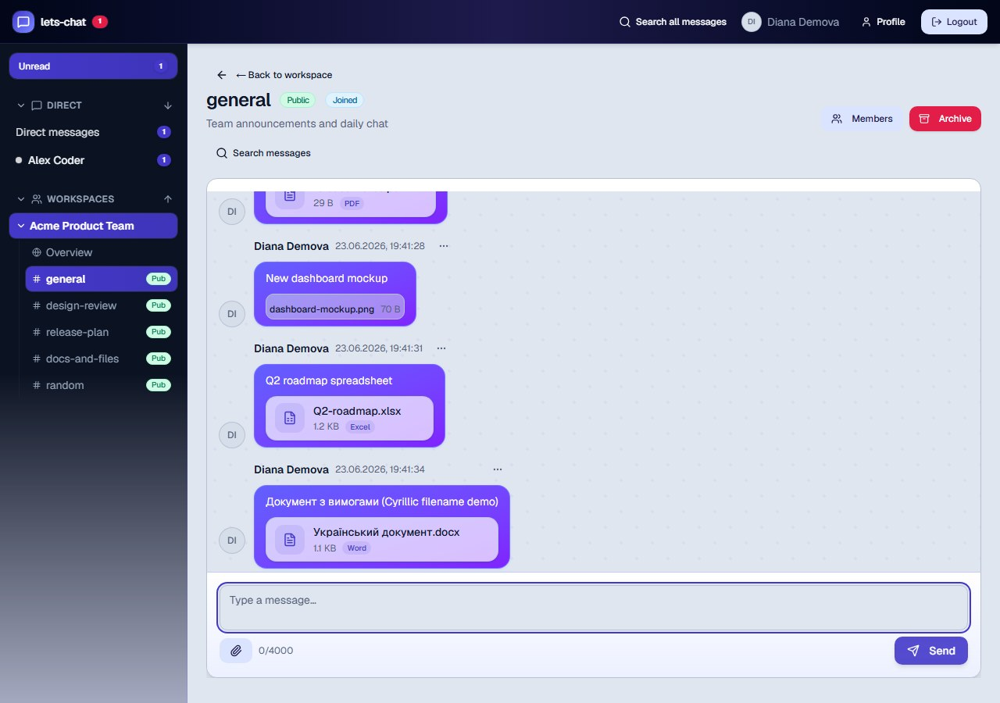 |
| Drag & drop overlay | 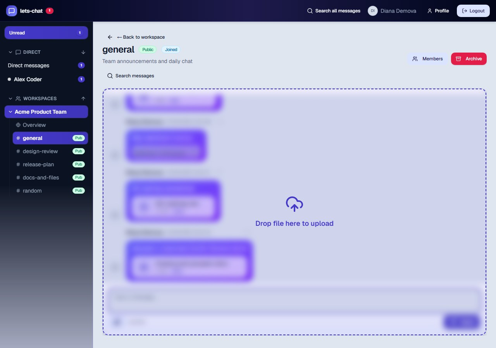 |
| Direct messages | 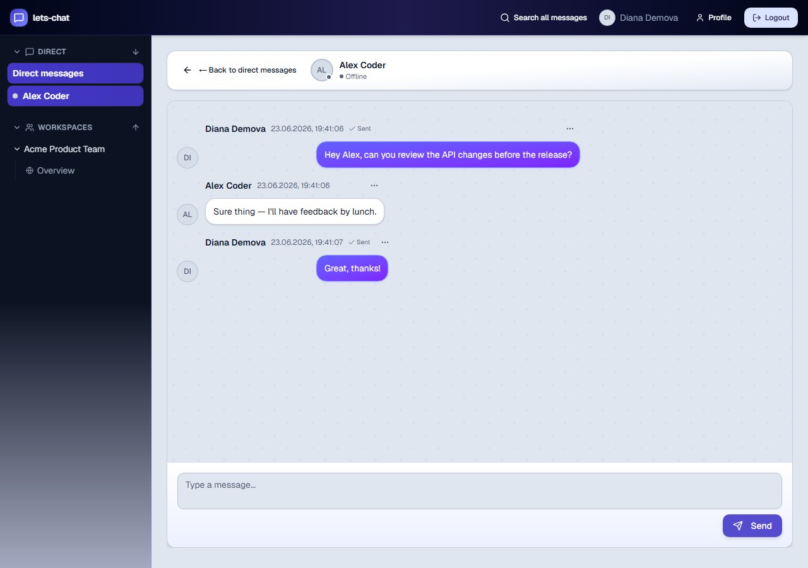 |
| Profile sessions | 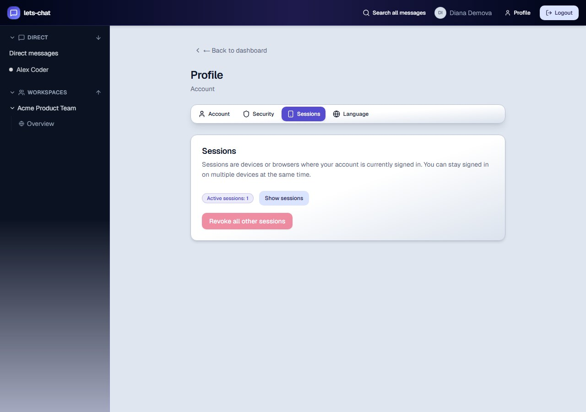 |
| Global search | 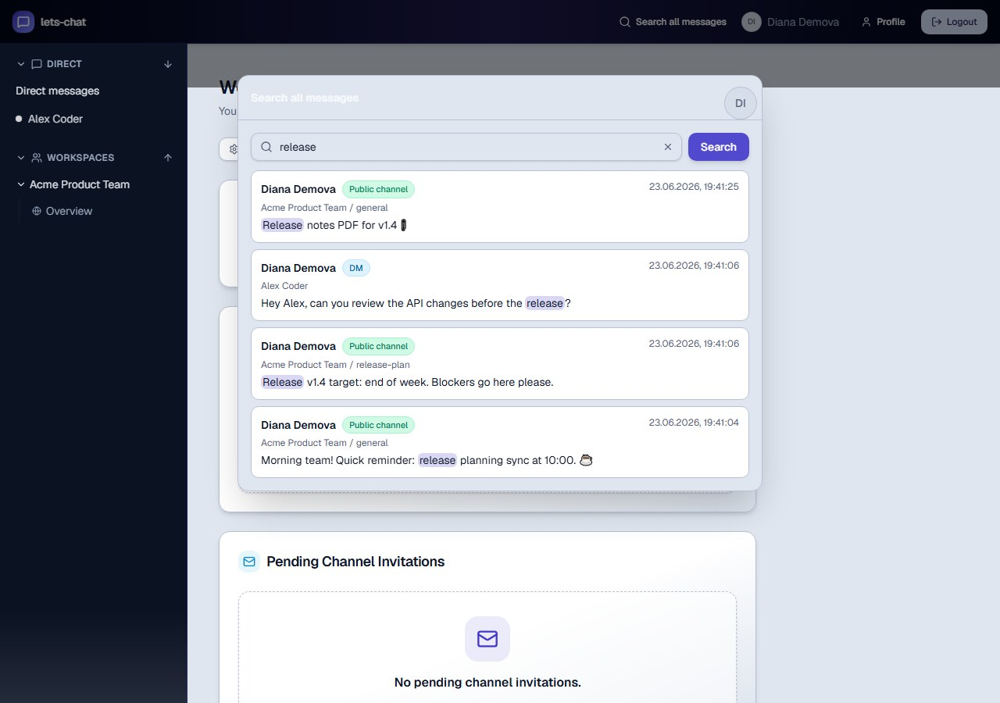 |

### Mobile

| Screen | Preview |
|---|---|
| Dashboard | 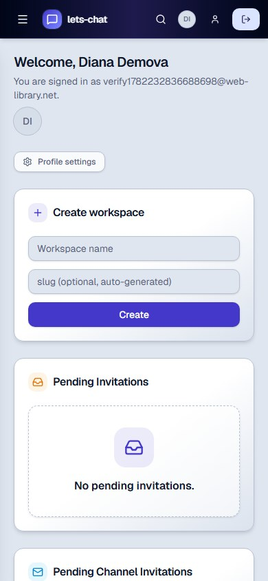 |
| Workspace | 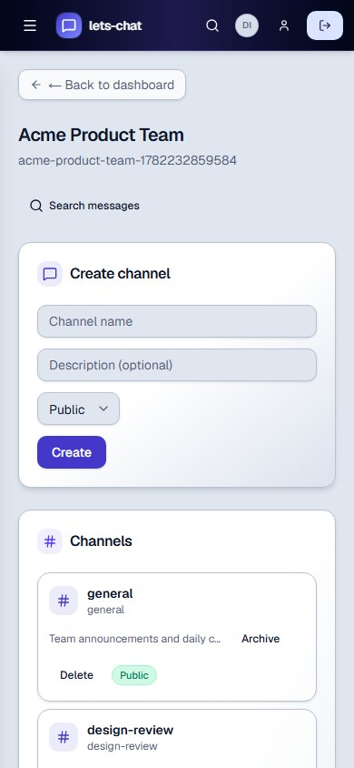 |
| Channel |  |
| Composer | 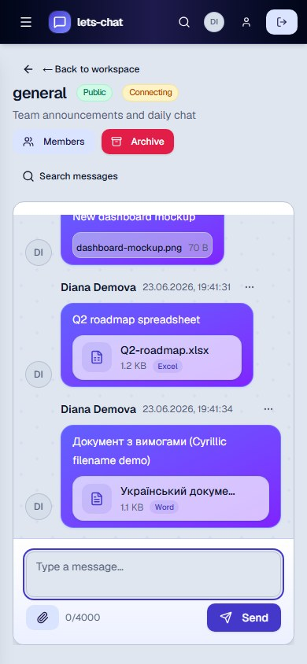 |
| Attachment card |  |
| Direct messages | 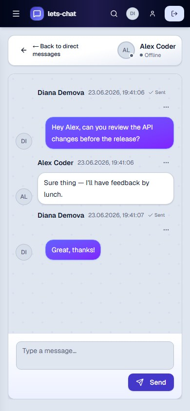 |

---

## 📁 Project Structure

```
secure-collab-platform/
├── apps/
│   ├── api/                 # NestJS backend
│   └── web/                 # Next.js frontend
├── packages/
│   ├── shared/              # Shared types & utilities
│   └── database/            # Prisma schema, client, migrations
├── docker-compose.yml       # PostgreSQL, Redis, MinIO
├── scripts/                 # Smoke/verification scripts
├── docs/
│   ├── portfolio-demo.md
│   ├── demo-script.md
│   ├── interview-notes.md
│   └── ...
└── README.md
```

---

## 🏁 Quick Start

### Prerequisites

- Node.js 20+
- pnpm
- Docker Desktop

### 1. Install dependencies

```bash
pnpm install
```

### 2. Configure environment

```bash
cp .env.example .env
```

Optional: generate VAPID keys if you want to test push notifications locally:

```bash
pnpm --filter api push:generate-vapid-keys
```

Then paste the keys into `.env` as `VAPID_PUBLIC_KEY`, `VAPID_PRIVATE_KEY`, and set `VAPID_SUBJECT` to a URL or `mailto:` address you control.

### 3. Start infrastructure

```bash
docker compose up -d
```

### 4. Run database migrations

```bash
pnpm --filter @lets-chat/database migrate
```

### 5. Generate Prisma Client

```bash
pnpm --filter @lets-chat/database generate
```

### 6. Start API (development)

```bash
pnpm --filter api start:dev
```

### 7. Start Web (development)

```bash
pnpm --filter web dev
```

**Verify:**

- Health: `GET http://localhost:3001/api/v1/health`
- Swagger: `http://localhost:3001/api/docs`
- Web app: `http://localhost:3000`

**Optional — enable recruiter demo mode:**

```bash
# In .env set DEMO_MODE_ENABLED=true, then restart the API.
# Clean up stale demo users/workspaces older than DEMO_SESSION_TTL_HOURS:
pnpm --filter api demo:cleanup
```

---

## 🧪 Running Tests

```bash
# API unit tests
pnpm --filter api test

# API E2E tests (requires Docker PostgreSQL)
pnpm --filter api test:e2e

# Web unit + page tests
pnpm --filter web test

# Lint
pnpm --filter web lint
pnpm --filter api lint

# Typecheck
pnpm --filter web typecheck
pnpm --filter api typecheck
```

---

## 🚢 Deploy Flow

```text
push main → GitHub Actions (lint/typecheck/test/build)
                ↓
      Migrate production database
                ↓
      Deploy API v2 to Render
                ↓
      Vercel production deploy
                ↓
      smoke-deploy.mjs + verify-production-attachments.mjs + verify-production-groups.mjs + verify-production-contacts.mjs + verify-production-admin-reports.mjs + verify-production-demo.mjs
```

No secrets, credentials, or DB URLs are committed to the repository.

---

## ⚠️ Known Limitations

- Render free tier cold start can take ~1 minute after idle.
- Real email delivery uses Resend by default. If Resend quota or outage occurs, configure `MAIL_FALLBACK_PROVIDER=smtp` plus `SMTP_*` env vars to keep auth emails flowing. `MAIL_PROVIDER=console` is local-dev only and must not be used in production.

- Presence is in-memory; a Redis Socket.io adapter is available via `WEBSOCKET_REDIS_URL` for horizontal scaling, but continuous adapter health is not yet monitored.
- Push notifications require valid VAPID keys in the API environment; without them the app works normally but push opt-in will report that notifications are not configured.

---

Built for portfolio/demo presentation. See [`docs/portfolio-demo.md`](docs/portfolio-demo.md) for the full walkthrough.
